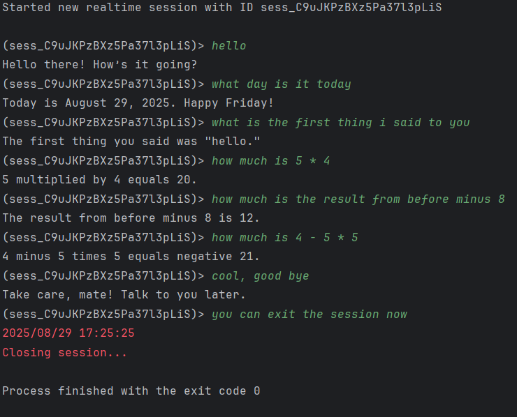

# Real-time GPT-4o-mini CLI

A terminal-based client for interacting with OpenAI’s Realtime API.  
This tool supports user input, function calls, and displays model responses in an interactive, live-updating terminal
interface.

---------------------------

---------------------------

## Installation & Configuration

```shell
git clone https://github.com/yechielb2000/GPT-4o-mini-CLI.git
cd GPT-4o-mini-CLI
go build; go install
chmod +x gpt4omini
./gpt4omini
```

> _Note_: You should have a config.yaml under the same directory with your binary.

You can configure the model and the api you are using via this `config.yaml`.  
The structure of the config yaml is [here](config/config_structure.go).

To configure via cli, you can run:

```shell
./gpt4omini config --help
```

You can set the `model` and the `instructions` for specific session but the default is taken from the
config file.

## Basic Usage

To start a session, You can run:

```shell
./gpt4omini session -t 'session-type'
```

This will create a conversation with the model you chose and with the session type you wanted.

To list all sessions types, you can run:

```shell
./gpt4omini session -s
```

For all flags and usage you can run:

````shell
./gpt4omini session --help
````

## architecture & Design choices

- assets - holds assets like images and videos
- cmd - the command line handlers (using cobra)
- config - the config file (instance, structure and handlers)
- random_tools - just an idea for showing functions that are being used by function calling the with the model.
- session - the Session interface and all session types.
- tests - nothing else here, but in the future we could use this for testing.
- types - holds all responses and events types, The DTOs of our sdk. 

The Design is pretty simple. We got the Session interface that shares anything that every session needs to have.  
For example, we use it in `realtime session`.

The Session interface is very functional and does a lot for us.
You only need to make a bridge between the user interface and the api. Depends on the session you need and the modality.

I was thinking to make the incomingMessages